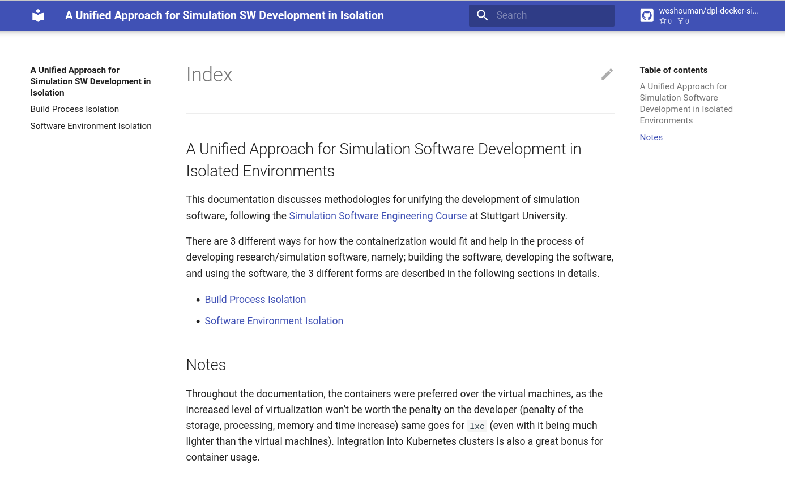

# Simulation Software Docker Deployment

This repo contains dockerfiles for unifying the development of simulation software, following the [Simulation Software Engineering Course](https://simulation-software-engineering.github.io/homepage/) at Stuttgart University.

## Documentation

[The documentation](https://weshouman.github.io/dpl-docker-sim-sw/) clarifies the philosophy that the different dockerfiles follow.

